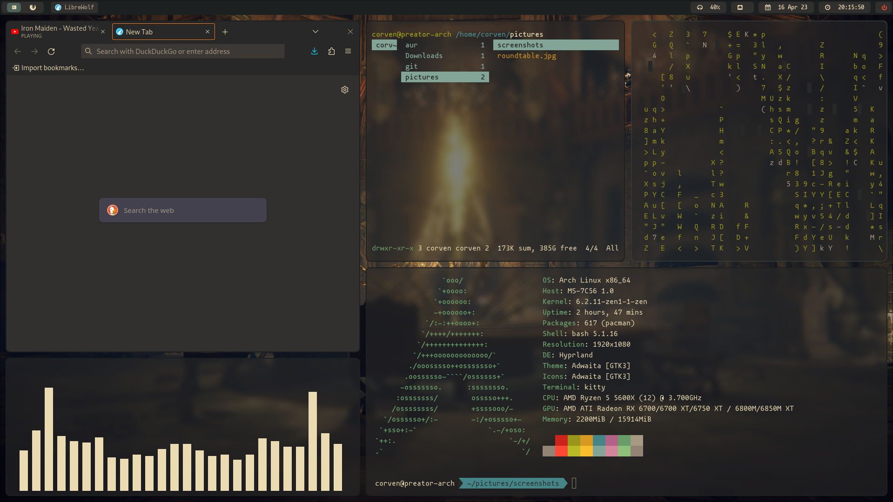

# corven's dotfiles

fonts are still fucked
picom is fucked
rest is good?

currently hypr focused on arch and hyprland



TODO
- setup the kitty manual install stuff. see kitty/setup.md

## setup
TBD

needs curl

```bash
sudo apt install -y curl && sh -c "$(curl -L https://raw.githubusercontent.com/mehermvr/dotfiles/master/.config/tools/install.sh)"
```

systemd user unit

```bash
systemctl --user enable ssh-agent.service
systemctl --user start ssh-agent.service
```

## Details

OS: I use Arch btw

Compositor: Hyprland

Bar: Waybar

Notifications: Mako

Terminal: kitty

Dotfiles manager: yadm

Theme: Gruvbox Dark

Editor: Neovim (not configured yet)

## License

```markdown
            DO WHAT THE FUCK YOU WANT TO PUBLIC LICENSE
                    Version 2, December 2004

 Copyright (C) 2004 Sam Hocevar <sam@hocevar.net>

 Everyone is permitted to copy and distribute verbatim or modified
 copies of this license document, and changing it is allowed as long
 as the name is changed.

            DO WHAT THE FUCK YOU WANT TO PUBLIC LICENSE
   TERMS AND CONDITIONS FOR COPYING, DISTRIBUTION AND MODIFICATION

  0. You just DO WHAT THE FUCK YOU WANT TO.
```
